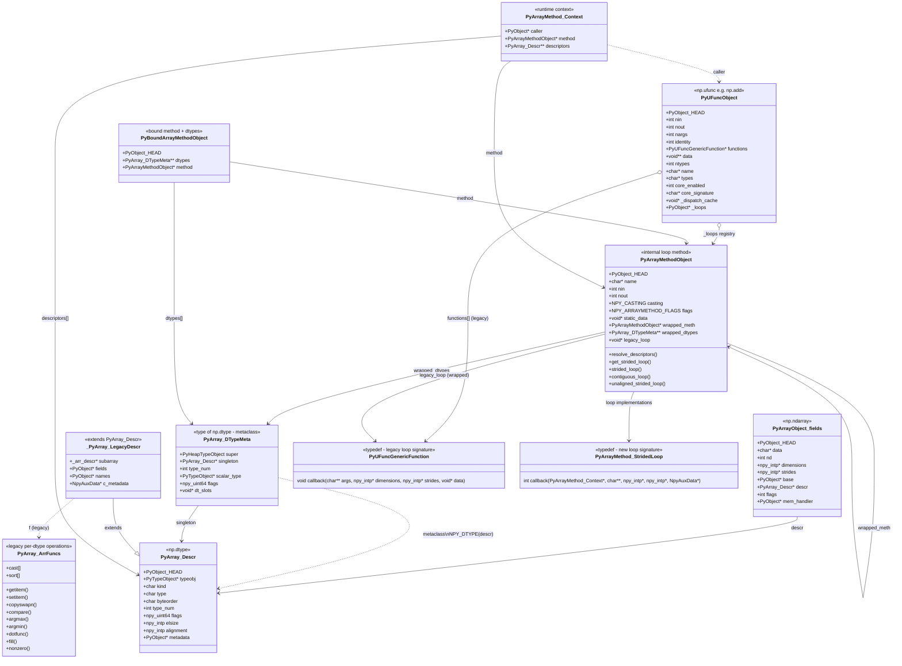

# NumPy Core C API - Object Relationships (UML)

> C structures with their Python counterparts annotated.
> Edit the Mermaid source below or the companion `.puml` file for PlantUML.

## Key Concepts

| C Structure | Python Equivalent | Role |
|---|---|---|
| `PyArrayObject_fields` | `np.ndarray` | N-dimensional array |
| `PyArray_Descr` | `np.dtype` | Data type descriptor (element type, size, byte order) |
| `PyArray_DTypeMeta` | `type(np.dtype(...))` | Metaclass for dtype instances (new DType system) |
| `PyUFuncObject` | `np.ufunc` (e.g. `np.add`) | Universal function with loop dispatch |
| `PyArrayMethodObject` | (internal) | Single typed implementation of a ufunc operation |
| `PyBoundArrayMethodObject` | (internal) | ArrayMethod bound to specific DType classes |
| `PyUFuncGenericFunction` | (typedef) | Legacy loop function pointer signature |
| `PyArrayMethod_StridedLoop` | (typedef) | New-style loop function pointer signature |
| `PyArray_ArrFuncs` | (legacy) | Per-dtype operation table (being phased out) |

## Dispatch Flow

1. **`PyUFuncObject`** receives a call (e.g. `np.add(a, b)`)
2. Resolves input dtypes and looks up the best **`PyArrayMethodObject`** from `_loops`
3. The **`PyArrayMethodObject`** resolves output descriptors via `resolve_descriptors()`
4. A concrete **`PyArrayMethod_StridedLoop`** (or legacy **`PyUFuncGenericFunction`**) is selected
5. The loop executes over array data, using **`PyArrayMethod_Context`** for runtime info

## Files

| Structure | Header |
|---|---|
| `PyArrayObject_fields`, `PyArray_Descr`, `PyArray_ArrFuncs` | `numpy/_core/include/numpy/ndarraytypes.h` |
| `PyUFuncObject`, `PyUFuncGenericFunction` | `numpy/_core/include/numpy/ufuncobject.h` |
| `PyArray_DTypeMeta` | `numpy/_core/include/numpy/dtype_api.h` |
| `PyArrayMethodObject` | `numpy/_core/src/multiarray/array_method.h` |
